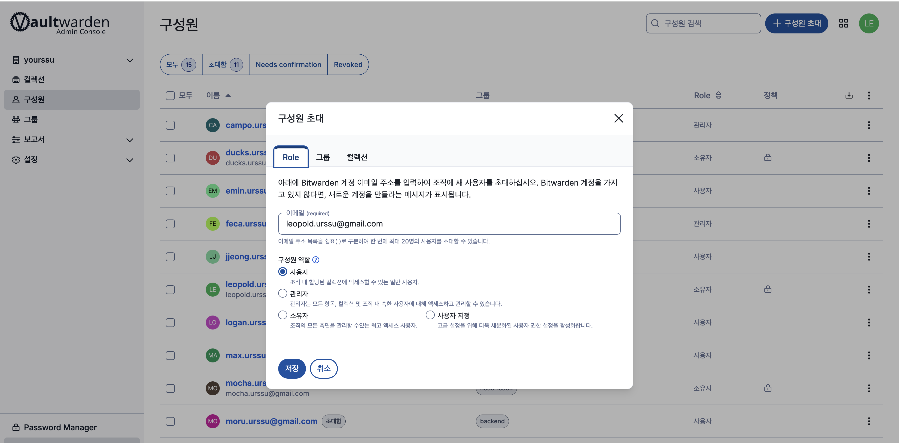
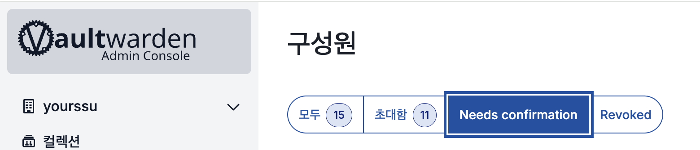
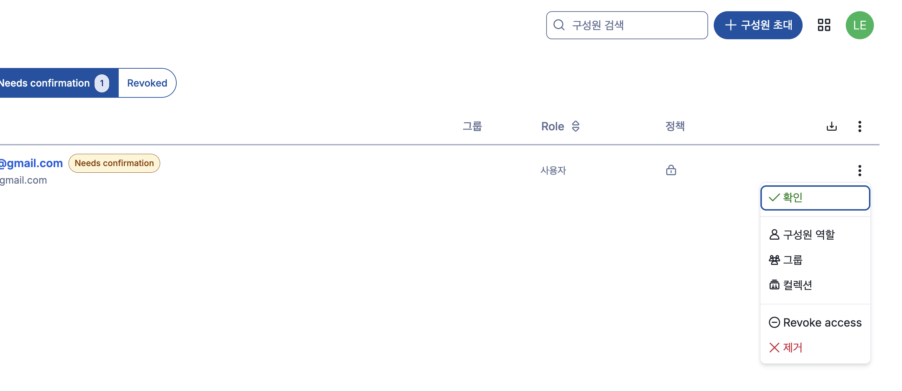
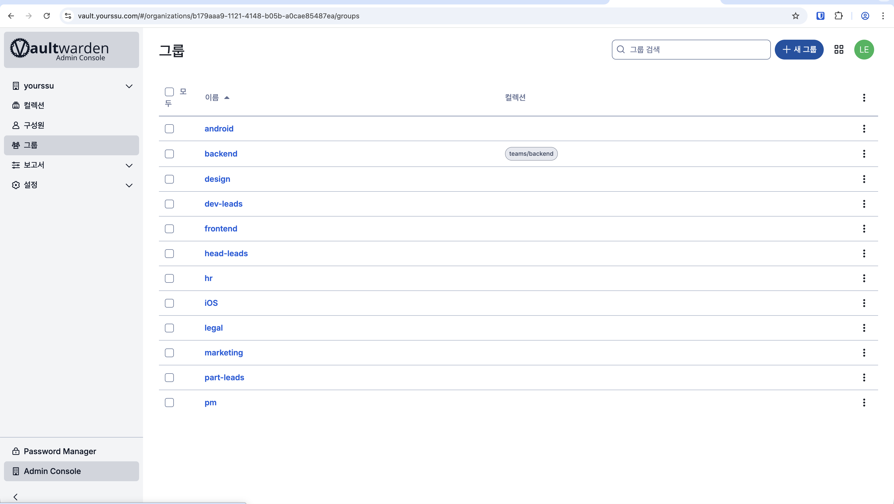
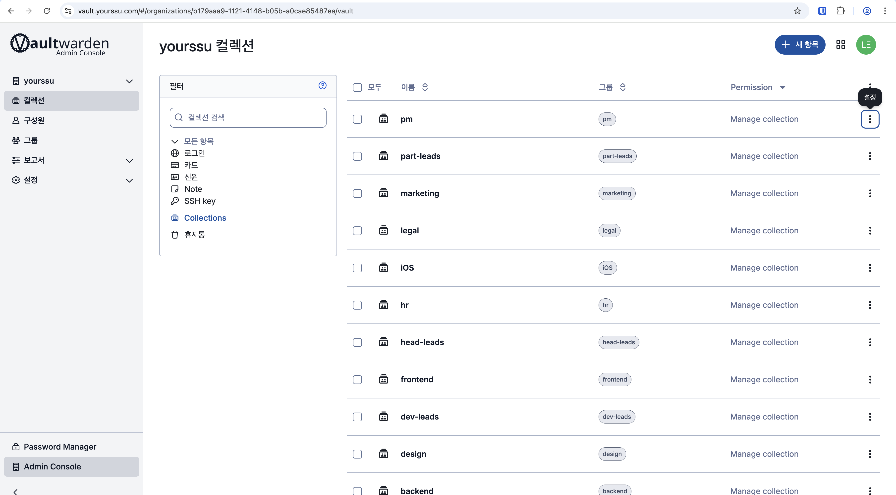
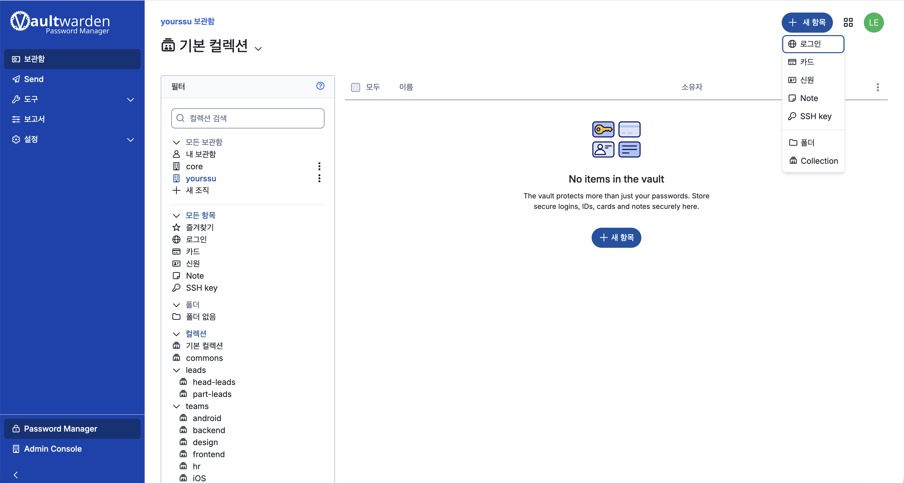

# Vault 관리자 가이드

관리자는 **Admin Console**을 통해 구성원 초대, 그룹 관리, 컬렉션 관리를 담당합니다.

> 관리자 콘솔 주소: `https://vault.yourssu.com/#/organizations/{org-id}/`
> 웹 보관함 좌측 하단 **Admin Console** 링크로도 접근할 수 있습니다.

---

## 목차

- [관리자 콘솔 둘러보기](#관리자-콘솔-둘러보기)
- [신규 멤버 초대하기](#신규-멤버-초대하기)
- [가입 확인(Confirm)하기](#가입-확인confirm하기)
- [그룹 관리](#그룹-관리)
  - [그룹 네이밍 정책](#그룹-네이밍-정책)
- [컬렉션 관리](#컬렉션-관리)
  - [컬렉션 네이밍 정책](#컬렉션-네이밍-정책)

---

## 관리자 콘솔 둘러보기

웹 보관함 좌측 하단의 **Admin Console** 버튼을 클릭하면 관리자 콘솔로 진입합니다.

좌측 메뉴 구성:
| 메뉴 | 설명 |
|------|------|
| 컬렉션 | 팀별 비밀번호 그룹 관리 |
| 구성원 | 멤버 초대, 역할 설정, 접근 권한 관리 |
| 그룹 | 팀/파트 단위 그룹 생성 및 컬렉션 연결 |
| 보고서 | 취약 비밀번호, 유출 비밀번호 등 보안 현황 |
| 설정 | 조직 설정 |

아래는 관리자 보관함 메인 화면입니다. 조직 전체의 항목을 한눈에 확인할 수 있습니다.

---

## 신규 멤버 초대하기

### 1단계 — 초대 발송

1. Admin Console 좌측 메뉴에서 **구성원** 클릭
2. 우측 상단 **+ 구성원 초대** 버튼 클릭
3. 초대할 이메일 주소 입력 및 역할 선택 후 **전송**

**역할 종류:**
- **관리자**: 구성원 관리, 컬렉션 생성/삭제 등 모든 권한
- **사용자**: 허용된 컬렉션만 접근 가능 (일반 팀원에게 권장)
- **소유자**: 조직 전체 권한 (최고 관리자)

---

### 2단계 — 초대 이메일 수신 (신규 멤버)

초대받은 멤버의 이메일로 아래와 같은 초대 메일이 발송됩니다.
멤버는 **Join Organization Now** 버튼을 클릭해 가입을 시작합니다.

---

### 3단계 — 마스터 비밀번호 설정 (신규 멤버)

버튼 클릭 시 `vault.yourssu.com` 으로 이동하며, 마스터 비밀번호 설정 화면이 나타납니다.

- **마스터 비밀번호**: 최소 12자 이상, 강력한 비밀번호 권장
- **마스터 비밀번호 힌트**: 비밀번호를 잊었을 때 참고할 힌트 (선택사항)
- 입력 완료 후 **계정 만들기** 클릭

> 마스터 비밀번호는 관리자도 복구할 수 없습니다. 멤버에게 반드시 안전하게 보관하도록 안내하세요.

---

### 4단계 — 이메일 2단계 인증 (신규 멤버)

계정 생성 후 이메일로 인증 코드가 발송됩니다. 멤버는 코드를 입력해 인증을 완료합니다.

---

## 가입 확인(Confirm)하기

신규 멤버가 초대를 수락하고 가입을 완료하면 **관리자가 직접 확인(Confirm)** 해줘야 합니다.
이 단계를 완료해야 멤버가 조직의 컬렉션에 접근할 수 있습니다.

### 확인 방법

1. Admin Console **구성원** 메뉴 이동
2. **Needs confirmation** 탭 클릭 — 확인 대기 중인 멤버 목록 표시

3. 해당 멤버 우측 **⋮ 메뉴** 클릭 후 **확인** 선택

> 초대 후 멤버가 가입하면 알림이 오지 않으므로, 주기적으로 **Needs confirmation** 탭을 확인해 주세요.

---

## 그룹 관리

그룹은 팀/파트 단위로 멤버를 묶어 **컬렉션 접근 권한을 일괄 부여**하는 데 사용합니다.

Admin Console 좌측 **그룹** 메뉴에서 현재 등록된 그룹을 확인하고 관리합니다.

### 그룹 네이밍 정책

그룹 이름은 `{category}:{value}` 형식으로 지정합니다. 모두 소문자, 단어 구분은 `-`(하이픈)을 사용합니다.

| 카테고리 | 의미 | 예시 |
|----------|------|------|
| `org` | 조직 전체 | `org:urssu` |
| `team` | 파트/팀 소속 | `team:be`, `team:fe`, `team:ios` |
| `role` | 역할/권한 | `role:part-lead`, `role:dev-lead`, `role:head-lead` |

**현재 등록된 그룹:**

| 그룹 | 설명 |
|------|------|
| `org:urssu` | 전체 구성원 |
| `team:android` | 안드로이드 파트 |
| `team:design` | 디자인 파트 |
| `team:fe` | 프론트엔드 파트 |
| `team:finance` | 재무 파트 |
| `team:hr` | 인사 파트 |
| `team:ios` | iOS 파트 |
| `team:legal` | 법무 파트 |
| `team:marketing` | 마케팅 파트 |
| `team:pm` | PM 파트 |
| `role:part-lead` | 파트 리드 |
| `role:dev-lead` | 개발 리드 |
| `role:head-lead` | 헤드 리드 |

### 새 그룹 만들기

1. **+ 새 그룹** 버튼 클릭
2. 그룹 이름 입력 — 네이밍 정책에 따라 `{category}:{value}` 형식으로 작성 (예: `team:be`, `role:part-lead`)
3. 접근을 허용할 **컬렉션** 선택
4. 저장

### 그룹에 멤버 추가하기

1. 그룹 이름 클릭 후 **구성원** 탭 선택
2. 추가할 멤버 검색 후 추가

또는 **구성원** 메뉴에서 개별 멤버의 **⋮ 메뉴 > 그룹** 을 통해 그룹을 지정할 수도 있습니다.

---

## 컬렉션 관리

컬렉션은 비밀번호 항목을 팀 단위로 묶어 **공유하는 단위**입니다.
멤버 또는 그룹에 컬렉션 접근 권한을 부여해 팀별로 계정을 분리 관리할 수 있습니다.

Admin Console 좌측 **컬렉션** 메뉴에서 전체 컬렉션을 확인합니다.

### 컬렉션 네이밍 정책

컬렉션 이름은 `{scope}:{resource}` 형식으로 지정합니다. 모두 소문자, 단어 구분은 `-`(하이픈)을 사용합니다.

모든 컬렉션은 `{scope}:{type}` 형식으로 지정합니다. `type`은 `key` 또는 `config` 둘 중 하나입니다.

- **`key`** — 유출 시 직접적인 피해가 생기는 민감한 자격증명 (서명 키, 계정, IAM)
- **`config`** — 앱·서버 구동에 필요한 설정값 (API 키, 설정 파일, 접속 정보)

| 컬렉션 | 내용 | 대상 그룹 |
|--------|------|-----------|
| `android:key` | keystore, Play Console 계정 | `team:android` |
| `android:config` | API 키, google-services.json 등 설정 파일 | `team:android` |
| `ios:key` | 인증서, App Store Connect 계정 | `team:ios` |
| `ios:config` | API 키, 설정 파일 | `team:ios` |
| `web:key` | OAuth secret, API secret | `team:fe` |
| `web:config` | 설정 파일, 환경변수 | `team:fe` |
| `infra:key` | SSH 키, 클라우드 IAM 자격증명 | infra 담당자 |
| `infra:config` | DB 접속 정보, 서버 설정 | infra 담당자 |
| `tool:finance` | 재무팀 SaaS·업무 도구 | `team:finance` |
| `tool:hr` | 인사팀 SaaS·업무 도구 | `team:hr` |
| `tool:marketing` | 마케팅팀 SaaS·업무 도구, SNS 계정 | `team:marketing` |
| `tool:legal` | 법무팀 SaaS·업무 도구 | `team:legal` |
| `tool:design` | 디자인팀 SaaS·업무 도구 | `team:design` |
| `tool:pm` | PM팀 SaaS·업무 도구 | `team:pm` |
| `shared:common` | 전사 공용 계정 | `org:urssu` |

현재 운영 중인 컬렉션은 위 표를 기준으로 총 **15개**로 고정합니다. 새 컬렉션이 필요한 경우 관리자에게 문의하세요.

### 새 컬렉션 만들기

1. 우측 상단 **+ 새 컬렉션** 클릭
2. 컬렉션 이름 입력 — 네이밍 정책에 따라 `{scope}:{type}` 형식으로 작성 (예: `android:key`, `tool:hr`)
3. 접근을 허용할 **그룹** 또는 **멤버** 선택 후 권한 설정
4. 저장

### 컬렉션에 항목 추가하기

웹 보관함에서 컬렉션을 선택한 뒤 **+ 새 항목** 버튼을 클릭해 로그인, 카드, 보안 메모 등을 추가할 수 있습니다.

### 권한 종류

| 권한 | 설명 |
|------|------|
| **Manage collection** | 항목 생성·수정·삭제 및 해당 컬렉션의 구성원 접근 권한 관리 |
| **Edit items** | 항목 추가·수정·삭제만 가능, 멤버 관리 불가 |
| **View items** | 읽기 전용 |

### 권장 권한 정책

> **정책: 컬렉션 권한은 반드시 그룹을 통해서만 부여합니다.**
> 개별 구성원에게 직접 컬렉션 권한을 지정하지 마세요. 그룹 기반으로 관리해야 권한 현황을 일관되게 파악하고 유지할 수 있습니다.
> 신규 멤버 추가 시에도 적절한 그룹에 배정하는 것으로 권한 부여를 완료하세요.

컬렉션 접근 권한은 아래 기준에 따라 부여하세요.

| 대상 | 권장 권한 | 비고 |
|------|----------|------|
| 일반 구성원 (파트별 그룹) | **Edit items** | 비밀번호 추가·수정은 가능하되 멤버 관리는 불필요 |
| 리드 (`role:head-lead`, `role:part-lead`, `role:dev-lead`) | **Manage collection** | 컬렉션 구성원 권한까지 관리 가능해야 함 |
| `shared:common` 컬렉션 전체 구성원 | **Edit items** | 공용 계정은 누구나 추가·수정 가능, 멤버 관리는 관리자만 |

> **주의:** 일반 구성원에게 **Manage collection** 을 부여하면 다른 멤버의 접근 권한을 임의로 추가·삭제할 수 있습니다. 파트별 그룹에는 반드시 **Edit items** 이하로 설정하세요.

---

### 컬렉션 구조 정책

> **정책: 중첩 컬렉션(상위/하위 구조)을 사용하지 않습니다.**
> 모든 컬렉션은 플랫(flat) 구조로 관리합니다. `teams/backend` 와 같이 `/` 로 구분하는 중첩 구조는 만들지 마세요.

중첩 컬렉션은 상·하위 모두 권한을 별도로 설정해야 하고 권한 현황 파악이 어려워집니다. 플랫 구조에서는 각 컬렉션과 그룹의 관계가 명확하게 유지됩니다.

**현재 컬렉션 구조:**

| 컬렉션 | 접근 그룹 |
|--------|----------|
| `android:key`, `android:config` | `team:android` |
| `ios:key`, `ios:config` | `team:ios` |
| `web:key`, `web:config` | `team:fe` |
| `infra:key`, `infra:config` | infra 담당자 |
| `tool:finance` | `team:finance` |
| `tool:hr` | `team:hr` |
| `tool:marketing` | `team:marketing` |
| `tool:legal` | `team:legal` |
| `tool:design` | `team:design` |
| `tool:pm` | `team:pm` |
| `shared:common` | `org:urssu` |

새 컬렉션이 필요하면 독립된 이름으로 생성하고, 해당 그룹에 권한을 부여하세요.

---

### 그룹과 직접 지정 권한이 겹칠 때

동일한 컬렉션에 그룹 권한과 개인 직접 지정 권한이 모두 존재하면, **더 높은 권한이 우선 적용**됩니다.

기준 권한을 **Edit items** 로 두고 예시:

| 그룹 권한 | 직접 지정 권한 | 최종 적용 |
|----------|--------------|---------|
| Edit items | View items | **Edit items** |
| Edit items | Manage collection | **Manage collection** |
| View items | Edit items | **Edit items** |
| Edit items | (없음) | **Edit items** |

> **단, Hide Passwords(비밀번호 숨기기) 는 예외입니다.** 어느 규칙 하나라도 비밀번호 숨기기가 설정되어 있으면, 다른 규칙이 더 높은 권한이어도 비밀번호는 보이지 않습니다.

---

## 멤버 접근 권한 관리

구성원 목록에서 개별 멤버의 **⋮ 메뉴**를 통해 다음 작업을 수행할 수 있습니다.

| 메뉴 | 설명 |
|------|------|
| 구성원 역할 | 관리자 / 사용자 역할 변경 |
| 그룹 | 소속 그룹 변경 |
| 컬렉션 | 개별 컬렉션 접근 권한 직접 설정 |
| Revoke access | 조직 접근 일시 차단 (계정 삭제 없이 비활성화) |
| 제거 | 조직에서 멤버 완전 삭제 |

---

## 자주 묻는 질문

**Q. 멤버가 초대 메일을 받지 못했어요.**
스팸 메일함을 확인하도록 안내하세요. 그래도 없다면 구성원 목록에서 해당 멤버를 선택 후 초대 재발송이 가능합니다. 재발송 후에도 안 온다면 서버의 SMTP 설정 이상일 수 있으니 인프라 담당자(ducks.urssu@gmail.com)또는 백엔드 리드에게 문의하세요.

**Q. 멤버가 가입했는데 컬렉션이 안 보인다고 해요.**
[Needs confirmation 탭](#가입-확인confirm하기)에서 해당 멤버를 확인(Confirm)했는지 먼저 확인하세요. Confirm 전까지는 컬렉션에 접근할 수 없습니다. Confirm 후에도 안 보인다면 해당 멤버가 속한 그룹에 컬렉션 권한이 부여되어 있는지 확인하세요.

**Q. 멤버가 "잘못된 서버 주소" 오류를 보고해요.**
확장 프로그램 또는 앱이 `bitwarden.com` 공식 서버를 바라보고 있을 가능성이 높습니다. 서버 URL을 `https://vault.yourssu.com` 으로 설정하도록 안내하세요. ([일반 사용자 가이드 참고](manual-for-general-users.md))

**Q. 멤버가 마스터 비밀번호를 분실했어요.**
Vault는 E2E 암호화 구조이므로 마스터 비밀번호는 서버에 저장되지 않아 **관리자도 복구할 수 없습니다.** 유일한 방법은 구성원 메뉴에서 해당 멤버를 **제거** 후 재초대하는 것입니다. 단, 개인 보관함 데이터는 완전히 소실됩니다. 조직 컬렉션의 데이터는 유지됩니다.

**Q. 멤버의 TOTP 코드가 계속 만료된다고 해요.**
TOTP는 서버와 클라이언트 간 시간이 일치해야 합니다. 서버의 시스템 시간이 NTP와 동기화되어 있는지 확인이 필요합니다. 인프라 담당자(ducks.urssu@gmail.com)에게 서버 시간 동기화 확인을 요청하세요.

**Q. 엑세스 권한이 없는 멤버는 어떻게 처리하나요.**
즉시 접근을 차단해야 한다면 **Revoke access** 로 일시 비활성화하고, 완전히 제거하려면 **제거** 를 선택하세요. 제거된 멤버의 개인 보관함 데이터는 삭제되지 않으나 조직 컬렉션에는 더 이상 접근할 수 없습니다. 퇴사 시에는 해당 멤버가 알고 있을 수 있는 조직 공용 계정의 비밀번호도 순차적으로 교체하는 것을 권장합니다.

**Q. 조직 데이터를 백업하고 싶어요.**
웹 보관함에서 **설정 > 내보내기** 기능을 통해 조직 전체 항목을 JSON 또는 CSV 형식으로 내보낼 수 있습니다. 내보낸 파일에는 비밀번호가 평문으로 포함되므로 안전한 곳에 보관하고, 필요 없어지면 즉시 삭제하세요.

**Q. 서버가 다운되면 저장된 비밀번호에 접근할 수 없나요.**
Bitwarden 클라이언트는 마지막으로 동기화된 데이터를 로컬에 암호화 캐시합니다. 서버 장애 중에도 잠금 해제 상태라면 기존에 동기화된 항목은 계속 사용할 수 있습니다. 단, 신규 항목 저장이나 수정은 서버 복구 후 가능합니다.
