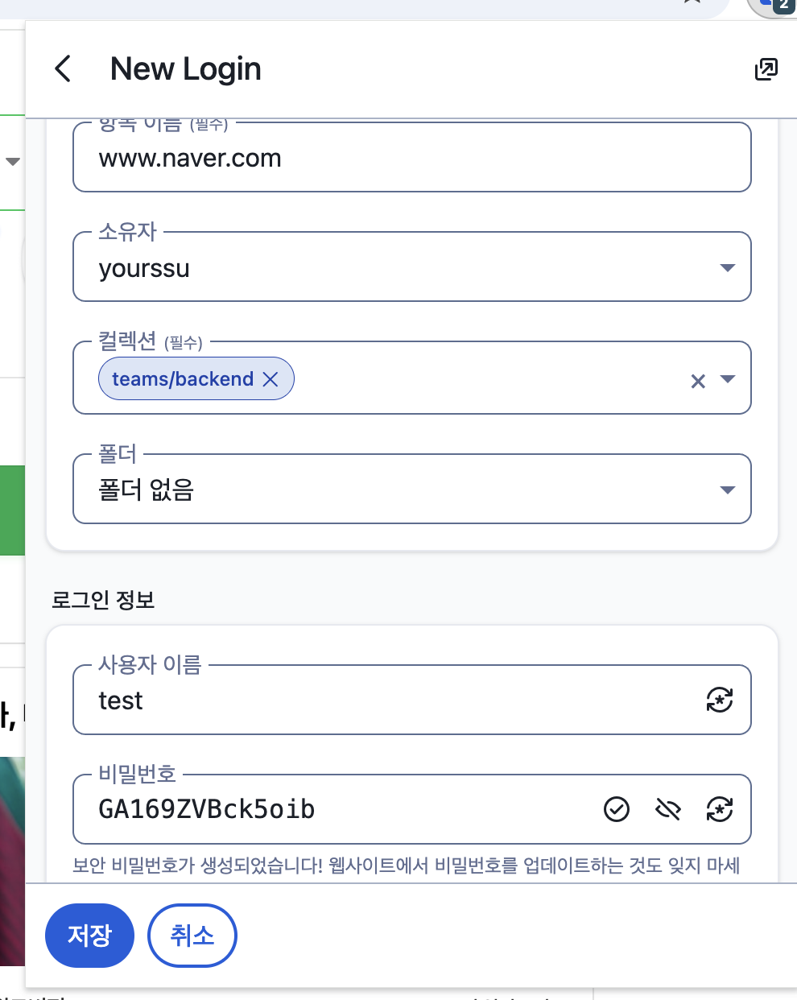

# Vault 일반 사용자용 설명서

Vault는 팀에서 함께 사용하는 **비밀번호 관리 서비스**입니다.
아이디와 비밀번호를 안전하게 저장하고, 웹사이트 로그인 시 자동으로 채워줍니다.

---

## 보안 구조 — 내 데이터는 안전한가요?

Vault는 **종단간 암호화(E2E Encryption)** 방식으로 동작합니다.
모든 데이터는 서버에 전송되기 전에 **본인의 마스터 비밀번호**를 기반으로 기기에서 암호화됩니다.

이것이 의미하는 바:

- **서버 관리자도 내 비밀번호를 볼 수 없습니다.** 서버에는 암호화된 데이터만 저장되며, 복호화 키(마스터 비밀번호)는 서버에 전달되지 않습니다.
- **개인 보관함에 저장한 항목은 오직 본인만 접근할 수 있습니다.** 마스터 비밀번호를 모르면 관리자도 내용을 확인할 수 없습니다.
- **마스터 비밀번호를 잃으면 데이터도 잃습니다.** 복호화가 불가능하기 때문에 어떤 방법으로도 복구할 수 없습니다.

> 단, **조직 컬렉션에 공유된 항목**은 조직 키로 암호화되어 권한을 가진 구성원 모두 접근 가능합니다.
> 조직에 공개되어선 안 되는 개인 정보는 반드시 **개인 보관함**에만 저장하세요.

---

## 목차

- [처음 가입하기 (초대 수락 및 계정 생성)](#처음-가입하기-초대-수락-및-계정-생성)
- [크롬 확장 프로그램으로 사용하기 (컴퓨터)](#크롬-확장-프로그램으로-사용하기-컴퓨터)
- [모바일 앱으로 사용하기](#모바일-앱으로-사용하기)

---

## 처음 가입하기 (초대 수락 및 계정 생성)

> **Vault는 관리자의 초대 없이는 가입할 수 없습니다.**
> 가입을 원한다면 아래 관리자에게 슬랙 디엠으로 초대를 요청하세요.
> - 백엔드 리드: @leopold
> - 인프라 담당: @ducks

초대 메일을 받았다면 아래 순서대로 진행하세요.

### 1단계 — 초대 메일 수락

**Yourssu Vault** 발신 메일을 확인하고 **Join Organization Now** 버튼을 클릭합니다.

> 메일이 보이지 않는다면 **스팸 메일함**을 확인해 보세요.


---

### 2단계 — 마스터 비밀번호 설정

버튼 클릭 시 `vault.yourssu.com` 가입 페이지로 이동합니다.

- **마스터 비밀번호**: 최소 12자 이상으로 설정 (강력한 비밀번호 권장)
- **마스터 비밀번호 확인**: 동일하게 한 번 더 입력
- **마스터 비밀번호 힌트**: 비밀번호를 잊었을 때 참고할 힌트 작성 (선택사항)

입력 완료 후 **계정 만들기** 버튼을 클릭합니다.

> 마스터 비밀번호는 관리자도 복구할 수 없습니다. 반드시 안전한 곳에 기록해 두세요.


---

### 3단계 — 이메일 인증

계정 생성 직후 이메일로 6자리 인증 코드가 발송됩니다.


메일에서 코드를 확인한 뒤, 인증 코드 입력 화면에 6자리 코드를 입력하고 **Continue logging in** 버튼을 클릭합니다.

> **"Don't ask again on this device for 30 days"** 를 체크하면 30일간 이 기기에서 인증을 생략할 수 있습니다.


---

### 4단계 — 가입 완료

인증이 완료되고 관리자의 승인이 완료되면 개인 보관함 화면으로 이동합니다.
좌측에 본인의 **개인 보관함**과 소속된 **조직(yourssu)** 이 함께 표시됩니다.


> 승인 전까지는 개인 보관함만 이용 가능하며, 조직 컬렉션은 보이지 않습니다.
> 승인이 지연된다면 관리자에게 문의하세요.

---

## 크롬 확장 프로그램으로 사용하기 (컴퓨터)

### 1단계 — 확장 프로그램 설치

크롬 웹 스토어에서 **Bitwarden 비밀번호 관리자**를 설치합니다.

[크롬 웹 스토어 바로가기](https://chromewebstore.google.com/detail/bitwarden-password-manage/nngceckbapebfimnlniiiahkandclblb)

또는 크롬 주소창에서 **확장 프로그램 검색 > bitwarden** 을 검색해 설치하세요.


설치 후 크롬 우측 상단의 확장 프로그램 아이콘을 클릭해 Bitwarden을 실행합니다.

---

### 2단계 — 서버 설정 (자체 호스팅)

처음 실행하면 아래와 같은 화면이 나타납니다. **로그인** 버튼을 클릭하세요.


로그인 화면에서 하단의 **"접근 중: bitwarden.com"** 을 클릭하면 서버를 선택할 수 있습니다.
드롭다운에서 **"자체 호스팅"** 을 선택하세요.


**서버 URL** 입력창에 아래 주소를 입력하고 **저장**을 클릭합니다.

```
https://vault.yourssu.com
```


---

### 3단계 — 로그인

초대 메일로 받은 이메일 주소를 입력하고 **계속** 버튼을 클릭합니다.


**마스터 비밀번호**를 입력하고 **마스터 비밀번호로 로그인** 버튼을 클릭합니다.

> 마스터 비밀번호는 회원가입 시 직접 설정한 비밀번호입니다. 분실 시 복구가 어려우니 꼭 기억해 두세요.


---

### 4단계 — 이메일 2단계 인증

로그인 시 이메일로 6자리 인증 코드가 발송됩니다.
메일함을 확인해 코드를 입력하고 **로그인하기** 버튼을 클릭합니다.

> **"Don't ask again on this device for 30 days"** 를 체크하면 30일간 이 기기에서는 인증을 생략할 수 있습니다.


이메일로 받은 인증 코드 예시입니다.


---

### 5단계 — 비밀번호 자동 완성 사용하기

로그인이 완료되면 웹사이트 방문 시 저장된 계정을 자동으로 제안해줍니다.
아이디/비밀번호 입력창 옆에 나타나는 **Bitwarden 아이콘**을 클릭하거나, 확장 프로그램 팝업에서 원하는 항목을 선택하면 자동으로 입력됩니다.


---

### 6단계 — 자동 완성 설정 (권장)

Bitwarden의 자동 완성 기능이 크롬 기본 자동 완성과 충돌할 수 있습니다.
확장 프로그램 설정에서 **"Turn off Chrome autofill"** 버튼을 클릭하면 더 원활하게 사용할 수 있습니다.


---

### 7단계 — TOTP 2단계 인증 코드 자동 복사

일부 사이트는 로그인 시 OTP 인증 앱의 6자리 코드를 요구합니다.
해당 계정에 TOTP가 등록되어 있다면 Bitwarden이 자동으로 코드를 생성하고 클립보드에 복사해줍니다.

인증 코드 입력창에 붙여넣기(Ctrl+V)만 하면 됩니다.


---

### 8단계 — 새 로그인 정보 저장하기

새로운 사이트에 가입하거나 비밀번호를 저장하고 싶을 때, 확장 프로그램을 열고 **+ 새 항목** 버튼을 클릭합니다.

- **항목 이름**: 사이트 이름 (예: www.naver.com)
- **소유자**: 내 계정 선택
- **사용자 이름 / 비밀번호** 입력

비밀번호를 새로 만들 때는 자동 생성 버튼을 활용하면 강력한 비밀번호를 쉽게 만들 수 있습니다.


팀과 공유하려면 **컬렉션**을 선택하세요. 팀 단위로 계정을 관리할 수 있습니다.



---

### 패스키(Passkey) 로그인

Bitwarden은 패스키도 지원합니다. 패스키가 저장된 사이트에서 로그인 시 아래와 같이 자동으로 패스키 선택 창이 나타납니다.


---

## 모바일 앱으로 사용하기

> 아래 설명은 **아이폰(iOS)** 기준입니다. 안드로이드도 UI는 거의 동일합니다.

### 1단계 — 앱 설치

- [App Store에서 설치 (iOS)](https://apps.apple.com/app/bitwarden-password-manager/id1137397744)
- [Google Play에서 설치 (Android)](https://play.google.com/store/apps/details?id=com.x8bit.bitwarden)

> 검색어: `Bitwarden Password Manager`
> 개발사: Bitwarden Inc.

---

### 2단계 — 서버 설정 및 로그인

앱을 실행한 뒤 **로그인** 버튼을 탭합니다.
이메일 입력 화면 하단의 서버 주소를 탭해 **자체 호스팅**을 선택하고 아래 주소를 입력하세요.

```
https://vault.yourssu.com
```

이메일 주소와 마스터 비밀번호를 입력해 로그인합니다.

---

### 3단계 — 이메일 2단계 인증

로그인 시 이메일로 인증 코드가 발송됩니다.
메일 앱에서 **Yourssu Vault** 발신 메일을 확인하고 코드를 앱에 입력합니다.


---

### 4단계 — 홈 화면 (보관함)

로그인이 완료되면 보관함 화면이 나타납니다.
저장된 **로그인**, **카드**, **신원**, **보안 메모**, **SSH 키** 항목을 유형별로 확인할 수 있습니다.

- **TOTP**: 2단계 인증 코드가 필요한 항목 수
- **로그인**: 저장된 아이디/비밀번호 항목

오른쪽 하단 **+** 버튼을 탭하면 새 항목을 추가할 수 있습니다.


---

### 5단계 — TOTP 인증 코드 확인

보관함 홈에서 **인증 코드** 항목을 탭하면 저장된 모든 사이트의 TOTP 코드를 한눈에 볼 수 있습니다.
코드 옆의 **복사 아이콘**을 탭하면 클립보드에 복사됩니다.

코드는 일정 시간마다 자동 갱신됩니다. 원형 타이머가 다 되기 전에 입력하세요.


---

### 6단계 — iOS 자동 완성 설정 (권장)

앱과 Safari에서 자동으로 비밀번호를 채우려면 iOS 설정에서 Bitwarden을 자동 완성 앱으로 지정해야 합니다.

1. iPhone **설정** 앱 실행
2. **일반 > 자동 완성 및 암호** 이동
3. **다음에서 자동 채우기** 목록에서 **Bitwarden** 을 활성화

> 다른 자동 완성 앱(암호, Chrome 등)은 비활성화하면 충돌 없이 더 원활하게 사용할 수 있습니다.


설정 완료 후 Safari나 앱에서 로그인 시 키보드 위에 Bitwarden 자동 완성 제안이 나타납니다.

---

## 자주 묻는 질문

**Q. 마스터 비밀번호를 잊어버렸어요.**
E2E 암호화 구조상 마스터 비밀번호는 서버에 저장되지 않아 관리자도 복구할 수 없습니다. 계정을 삭제하고 재초대받는 것 외에 방법이 없으며, 개인 보관함의 데이터는 복구 불가능합니다. 처음 가입 시 반드시 안전한 곳에 기록해 두세요.

**Q. 초대 메일이 오지 않아요.**
스팸 메일함을 확인해 보세요. 그래도 없다면 아래 관리자에게 슬랙으로 문의하세요.
- 백엔드 리드: leopold.urssu@gmail.com / 슬랙 @leopold
- 인프라 담당: ducks.urssu@gmail.com / 슬랙 @ducks

**Q. 로그인 시 "잘못된 사용자 이름 또는 비밀번호"가 뜨는데 분명히 맞아요.**
확장 프로그램이 `bitwarden.com` 공식 서버로 연결되어 있을 수 있습니다. [서버 설정 단계](#2단계--서버-설정-자체-호스팅)를 다시 확인해 서버 URL이 `https://vault.yourssu.com` 으로 설정되어 있는지 확인하세요.

**Q. 확장 프로그램이 자동 완성을 제안하지 않아요.**
Bitwarden이 잠금 상태인지 확인하세요. 확장 프로그램 아이콘을 클릭해 마스터 비밀번호로 잠금을 해제해야 자동 완성이 작동합니다. 일부 사이트는 보안 정책(CSP)으로 인해 자동 완성이 제한될 수 있으며, 이 경우 확장 프로그램 팝업에서 직접 복사해 사용하세요.

**Q. 브라우저를 열 때마다 Bitwarden에 다시 로그인해야 해요.**
확장 프로그램 설정에서 잠금 해제 방식을 **PIN** 또는 **생체 인식**으로 변경하면 매번 마스터 비밀번호를 입력하지 않아도 됩니다. 설정 > 보안 > 잠금 해제 옵션에서 변경할 수 있습니다.

**Q. TOTP 인증 코드가 계속 만료됐다고 나와요.**
TOTP는 서버와 기기 간의 시간이 정확히 맞아야 동작합니다. 기기의 시간이 자동으로 설정되어 있는지 확인하고, 그래도 문제가 지속되면 관리자에게 서버 시간 동기화를 요청하세요.

**Q. 로그인 후 저장 팝업이 뜨지 않아요.**
일부 사이트는 로그인 버튼 없이 자바스크립트로 처리되어 Bitwarden이 인식하지 못할 수 있습니다. 이 경우 확장 프로그램 팝업을 직접 열어 **+ 새 항목**으로 수동 저장하세요.

**Q. 가입했는데 조직 컬렉션이 보이지 않아요.**
관리자가 아직 계정을 승인(Confirm)하지 않은 상태입니다. 관리자에게 승인을 요청하세요.
